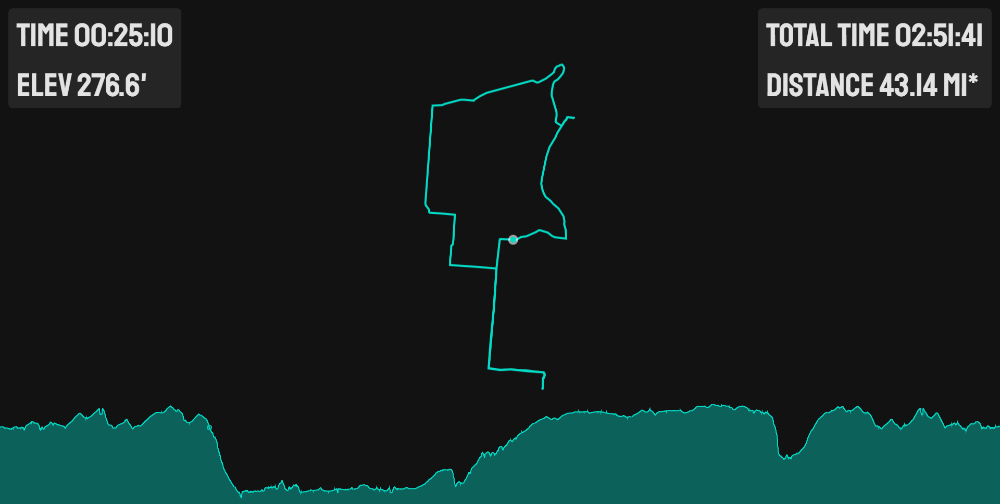

# GPX Visualize

A simple visualization for GPS tracks with a dark and light theme.





```javascript
//LIGHT THEME IS DEAFULT
//?theme=dark&ride=link to CORS gpx file
var themes = {
  dark: {
    mainColor: "#121212", //background color
    fontColor: "rgba(255,255,255,0.87)",
    trackColor: "#03dac5",
    chartColor: "rgba(3, 218, 197, 0.4)"
  },
  light: {
    mainColor: "#fff",
    fontColor: "#121212",
    trackColor: "rgba(178, 34, 34,0.8)",
    chartColor: "rgba(178, 34, 34,0.4)"
  }
}
```